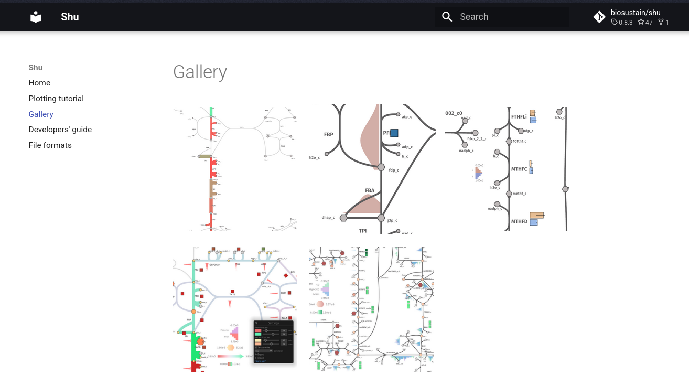
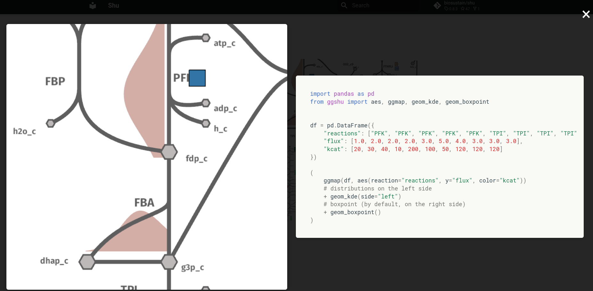

# mkdocs-gallery

```yaml
plugins: 
  # clone the repo and pip install it before running mkdocs
  - mkdocs-gallery
```


> [!IMPORTANT]  
> This was 99% generated by an LLM, so don't expect the highest code quality.
> `gallery.js` and `gallery.css` (from [here](https://github.com/biosustain/shu/tree/master/docs/assets)) must be added to the `docs/assets` folder to make it work properly.

Plugin for [MkDocs](https://www.mkdocs.org/) to make a gallery.

A single file called `gallery.md` should contain images interleaved with fenced codeblocks. For instance:


```markdown


```python
import pandas as pd
from ggshu import aes, ggmap, geom_arrow

df = pd.DataFrame({
    "reactions": ["PFK", "ENO", "PYK", "GAPD", "PGI", "PGK", "PGM", "TPI"],
    "flux": [0.1, 0.2, 0.3, 0.4, 0.5, 0.6, 0.7, 0.8],
    "kcat": [20, 30, 40, 10, 200, 100, 50, 120]
})

(
    ggmap(df, aes(reaction="reactions", size="flux", color="kcat"))
    + geom_arrow()
)
```  

This will be translated into a grid of images that, on click, will zoom in the image and show the associated code.

## Example

`mkdocs-gallery` is used by [shu](https://biosustain.github.io/shu/docs/gallery/) to make its gallery of examples.



On click:


